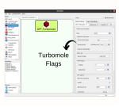

# DFT-Turbomole
The DFT-Turbomole WaNo implements a wide range of methods available within the Turbomole code, based on Gaussian basis sets this code has been applied for the development of many fast and low-scaling algorithms in the recent decades, turning it into one of the most widely used electronic structure programs. This WaNo affords experienced and inexperienced users to perform DFT and TDDFT calculations without requiring a deep understanding of Turbomole functionalities and specifications. The structure file in xyz format is the single mandatory file as the input of the WaNo. All the remaining input files are automatically generated or loaded from an external source.

Figure 1 shows that this WaNo has the INCAR, KPOINTS, Analysis, and Files_Run tabs. The first one aims to define the INCAR file. This tab might be changed whenever the problem requires more input parameters, which is attained by adding the necessary flags in the XML file. The remaining tabs create the KPOINTS file, allows the user to perform DOS and Bader Charge Analysis, and the Files_Run controls the VASP compilation types (vasp_std, vasp_gam, and  vasp_ncl). It loads the POSCAR file and, as an option, may load INCAR, POTCAR, KPOINTS too.

## Description

This is a sample WaNo.

## Parameters

**Input File:**
* just a sample input file

### General Settings

**Print** (default: "Text")
* Determines wether the Number or the String will be printed

**Text:** (default: "Text")
* The String that will be printed

**Number:** (default: 10 )
* The Number that will be printed  
 

## Output
**output.txt** 
* the file including the output

**output.txt**
