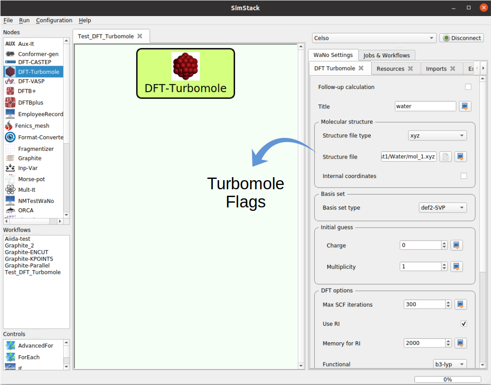

# DFT-Turbomole
The DFT-Turbomole WaNo implements a wide range of methods available within the Turbomole code, based on Gaussian basis sets this code has been applied for the development of many fast and low-scaling algorithms in the recent decades, turning it into one of the most widely used electronic structure programs. This WaNo affords experienced and inexperienced users to perform DFT and TDDFT calculations without requiring a deep understanding of Turbomole functionalities and specifications. The structure file in xyz format is the single mandatory file as the input of the WaNo. All the remaining input files are automatically generated or loaded from an external source.



Figure 1 displays the Turbomole flags, where we can name the calculation and define the following field of parameters: `Molecular structure`, `Basis set`, `initial guess`, `DFT options` and `Type of calculation`.

## 1. Python Setup
To get this WaNo up running on your available computational resources, make sure to have the below libraries installed on Python 3.6 or newer.

```
1. Atomic Simulation Environment (ASE).
2. Python Materials Genomics (Pymatgen).
3. subprocess, glob, os, sys, yaml. 
```

## 2. DFT-Turbomole Inputs files 
- **Follow-up calculation**: This option performs calculations from previous simulations.
- **Title**: Name the structure in the `control` file.
- **Molecule structure**: Here the user can define the input geometry format and load the structure input file.
- **Basis set**: Here the user can choose the basis set type.
- **Initial guess**: In this box, we set up the initial charge and multiplicities of the system.
- **DFT options**: This box sets up the basic DFT parameters, such as the maximum number of self-consistent steps, exchange-correlation functional, integration grid, van-der-Waals corrections, and solvation effects(treated by the COSMO). 
- **Type of calculation**: Here the user can perform Structure optimization, Excited states (TDDFT), and frequency (vibrational states) calculations. 
- 
## 3. DFT-Turbomole Output files 
   - results.tar.xz (contains all the following files: `alpha`,`auxbasis`, `basis`,`beta`,`control`,`coord`,`energy`,`forceapprox`,`gradient`,`hessapprox`,`mos`,`optinfo`,`rendered_wano.yml`,`sing_a`,`trip_a`,`unrs_a`)
   - turbomole_results.yml (contains some info like energy value, energy unit, the title of the structure, and the Homo-Lumo gap of the system).
   - final_structure.xyz (final structure after the calculation)


